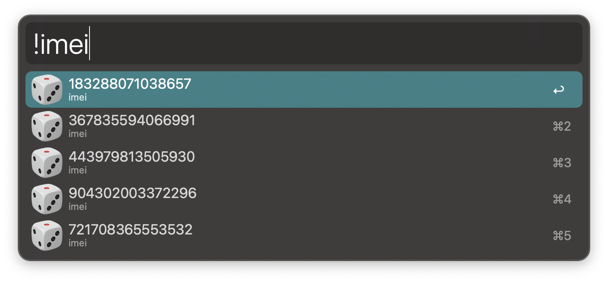

## ALFRED-RANDOMER

[Alfred Workflow](https://www.alfredapp.com/workflows/) to generate random values for different data types 🎲️

## Key

* !imei
* !email
* !unit
* !uuid
* !phone
    * !phoneus
    * !phoneuk
    * !phonerr
    * !phonecn